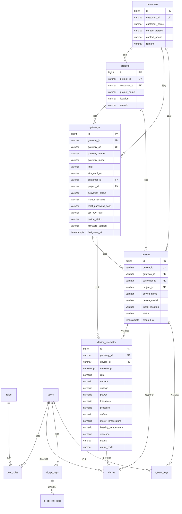

# 数据库 ER 图说明

本文档为 Phase 1 数据库设计说明，严格按 `AGENTS.md` 当前版本整理。

现场 Modbus TCP 由物联网盒子采集，云端不配置寄存器、不配置点位、不直连现场设备。云端只接收盒子通过 MQTT 或 HTTP REST API 上传的数据。

## ER 图

## 设计重点

- `customers`、`projects` 用于客户和项目归属管理。
- `gateways` 是物联网盒子管理主体，激活后生成 MQTT 用户名、MQTT 密码哈希、API Key 哈希。
- `devices` 是网关下挂设备，不表示云端直连设备。
- `device_telemetry` 保存盒子通过 MQTT/HTTP 上传的标准风机遥测数据。
- 平台不保存 Modbus TCP 点位配置表，不执行现场采集逻辑。
