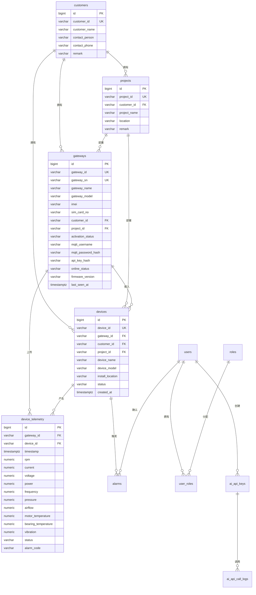

# Phase 1 架构设计

本文档严格按 `AGENTS.md` 的 Phase 1 范围整理：数据库设计、Docker Compose、项目目录结构、README。本文档不包含业务代码实现。

## 系统边界

平台部署在云服务器，负责接收物联网盒子上传的数据。

现场链路：

```text
Industrial Fan / PLC / Inverter
        |
IoT Gateway / Edge Box
        |
MQTT or HTTP
        |
Private Cloud Platform
        |
PostgreSQL
        |
AI Open API
```

平台不负责：

- PLC 开发
- 变频器开发
- Modbus TCP 寄存器配置
- Modbus TCP 点位配置
- 现场采集逻辑
- AI 训练
- 大模型开发

## ER 设计



## 数据上传设计

MQTT Topic：

```text
iot/gateway/{gatewayId}/telemetry
iot/gateway/{gatewayId}/alarm
iot/gateway/{gatewayId}/status
```

HTTP API：

```text
POST /api/iot/telemetry
POST /api/iot/alarm
POST /api/iot/status
```

遥测示例：

```json
{
  "gatewayId": "BOX001",
  "deviceId": "FAN001",
  "timestamp": "2026-06-03T10:00:00Z",
  "data": {
    "rpm": 1450,
    "current": 12.6,
    "voltage": 380,
    "power": 5.8,
    "frequency": 50,
    "pressure": 520,
    "airflow": 3200,
    "motorTemperature": 62,
    "bearingTemperature": 58,
    "vibration": 1.8,
    "status": "running",
    "alarmCode": null
  }
}
```

## Docker Compose 基础框架

Phase 1 重点是基础设施：

- PostgreSQL
- Redis
- MQTT Broker
- 后端目录预留
- 前端目录预留

当前 `docker-compose.yml` 已包含上述服务，并预留 `backend`、`frontend` 服务定义，后续 Phase 2/3 使用。

建表 SQL：

```text
backend/src/main/resources/db/migration/V1__init_schema.sql
```

## Phase 1 检查项

- 数据表覆盖 `AGENTS.md` 必需表。
- 网关、客户、项目、设备之间具备外键关系。
- 遥测表覆盖风机核心数据字段。
- MQTT 和 HTTP 上传入口已规划。
- Docker Compose 不包含云端 Modbus TCP 采集服务。
- README 已说明 Phase 2 实施计划。
